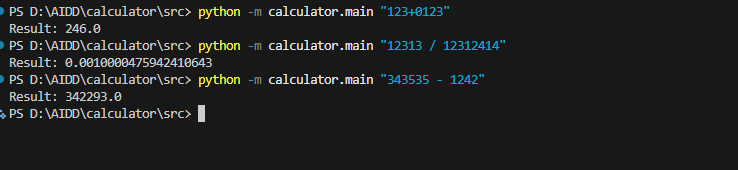

## Constitution 

<!--
---
sync_impact_report:
  version_change: "none -> v1.0.0"
  modified_principles:
    - "New Principle: Simplicity and Focus"
  added_sections: []
  removed_sections:
    - "Principle 2: [PRINCIPLE_2_NAME]"
    - "Principle 3: [PRINCIPLE_3_NAME]"
  template_updates:
    - path: ".specify/templates/plan-template.md"
      status: "pending"
    - path: ".specify/templates/spec-template.md"
      status: "pending"
    - path: ".specify/templates/tasks-template.md"
      status: "pending"
  todos: []
---
-->
# Constitution for Simple Calculator

> This document outlines the non-negotiable principles governing the Simple Calculator project. All specifications, plans, and code MUST adhere to these rules.

**Version**: `v1.0.0`
**Ratification Date**: `2025-12-02`
**Last Amended**: `2025-12-02`

---

## 1. Guiding Principles

### Principle 1: Simplicity and Focus

- **Description**: The project must focus exclusively on basic arithmetic operations (addition, subtraction, multiplication, division). No scientific, financial, or other complex functions will be included.
- **Rationale**: To maintain a lightweight, easy-to-use, and bug-free application. This aligns with the project's core identity as a 'simple calculator'.

---

## 2. Governance and Amendments

This constitution is a living document. Amendments can be proposed via a pull request and MUST be ratified by the project owner.

### Versioning

Changes to this constitution MUST follow semantic versioning:
- **MAJOR**: Backward-incompatible changes (e.g., removing a core principle).
- **MINOR**: Adding a new principle or significant new guidance.
- **PATCH**: Clarifications, typo fixes, or minor wording changes.

### Compliance

All project artifacts (specifications, plans, code) are subject to review for compliance with this constitution. Non-compliant work MUST be revised. 


## Specify 

# Feature Specification: Calculate Expression

**Constitution Reminder**: All specifications MUST adhere to the "Simplicity and Focus" principle. Features must be limited to basic arithmetic operations.

**Feature Branch**: `001-calculate-expression`
**Created**: 2025-12-02
**Status**: Draft
**Input**: User description: "Calculator: input expr(string) -> output result(number)"

## User Scenarios & Testing *(mandatory)*

### User Story 1 - Basic Arithmetic Calculation (Priority: P1)

As a user, I want to input a simple arithmetic expression as a string, so that I can get the calculated result as a number.

**Why this priority**: This is the core functionality of the calculator.

**Independent Test**: This can be tested by providing a valid arithmetic expression string and verifying that the output is the correct numerical result.

**Acceptance Scenarios**:

1.  **Given** the calculator is ready, **When** the user inputs "2+2", **Then** the system returns 4.
2.  **Given** the calculator is ready, **When** the user inputs "10-3", **Then** the system returns 7.
3.  **Given** the calculator is ready, **When** the user inputs "5*5", **Then** a system returns 25.
4.  **Given** the calculator is ready, **When** the user inputs "10/2", **Then** the system returns 5.
5.  **Given** the calculator is ready, **When** the user inputs "10/0", **Then** the system returns an error indicating division by zero.

### Edge Cases

-   What happens when the input string is empty?
-   What happens when the input string is not a valid arithmetic expression (e.g., "a+b", "2++2")?
- The calculator MUST support floating-point numbers.

## Requirements *(mandatory)*

### Functional Requirements

-   **FR-001**: System MUST accept a single string as input representing an arithmetic expression.
-   **FR-002**: System MUST parse and evaluate the input expression.
-   **FR-003**: System MUST support the four basic arithmetic operations: addition (+), subtraction (-), multiplication (*), and division (/).
-   **FR-004**: System MUST return the result of the calculation as a number.
-   **FR-005**: System MUST produce a distinct and clear error for division-by-zero events.
-   **FR-006**: System MUST produce a clear error for malformed or invalid expressions.

## Success Criteria *(mandatory)*

### Measurable Outcomes

-   **SC-001**: 100% of valid basic arithmetic expressions involving integers are calculated correctly.
-   **SC-002**: The system provides a clear and understandable error message for 100% of invalid expressions, including division by zero.
-   **SC-003**: The time to calculate and return a result for a single expression MUST be less than 500ms.


## Plan 

# Implementation Plan: Calculate Expression

**Branch**: `001-calculate-expression` | **Date**: 2025-12-02 | **Spec**: [./spec.md](./spec.md)
**Input**: Feature specification from `specs/001-calculate-expression/spec.md`

**Note**: This template is filled in by the `/sp.plan` command. See `.specify/templates/commands/plan.md` for the execution workflow.

## Summary

This plan outlines the implementation of a simple command-line calculator that takes a string expression, validates it, evaluates it, and returns a number.

## Technical Context

**Language/Version**: Python 3.11
**Primary Dependencies**: None
**Storage**: N/A
**Testing**: pytest
**Target Platform**: CLI
**Project Type**: single
**Performance Goals**: < 500ms per expression
**Constraints**: Basic arithmetic only (integers and floating-point numbers)
**Scale/Scope**: Single user

## Constitution Check

*GATE: Must pass before Phase 0 research. Re-check after Phase 1 design.*

*   [X] **Simplicity and Focus**: The plan does not introduce any features beyond basic arithmetic (add, subtract, multiply, divide).

## Project Structure

### Documentation (this feature)

```text
specs/001-calculate-expression/
├── plan.md              # This file (/sp.plan command output)
├── research.md          # Phase 0 output (/sp.plan command)
├── data-model.md        # Phase 1 output (/sp.plan command)
├── quickstart.md        # Phase 1 output (/sp.plan command)
└── tasks.md             # Phase 2 output (/sp.tasks command - NOT created by /sp.plan)
```

### Source Code (repository root)

```text
# Option 1: Single project (DEFAULT)
src/
└── calculator/
    ├── __init__.py
    └── main.py

tests/
└── test_calculator.py
```

**Structure Decision**: A single project structure is sufficient for this simple CLI tool. The core logic will be in `src/calculator/main.py` and tests in `tests/test_calculator.py`.

## Complexity Tracking

> **Fill ONLY if Constitution Check has violations that must be justified**

| Violation | Why Needed | Simpler Alternative Rejected Because |
|---|---|---|
| N/A | | |


## Tasks 

# Tasks: Calculate Expression

**Input**: Design documents from `specs/001-calculate-expression/`
**Prerequisites**: plan.md (required), spec.md (required for user stories)

## Phase 1: Setup (Shared Infrastructure)

- [X] T001 Create project directories: `src/calculator`, `tests`
- [X] T002 [P] Create `src/calculator/__init__.py`
- [X] T003 [P] Create `src/calculator/main.py`
- [X] T004 [P] Create `tests/test_calculator.py`

---

## Phase 2: User Story 1 - Basic Arithmetic Calculation (Priority: P1) 🎯 MVP

**Goal**: Implement the core calculator logic to parse and evaluate basic arithmetic expressions.

**Independent Test**: The calculator can be run with a string expression and will return the correct numerical result or a descriptive error message.

### Tests for User Story 1

- [X] T005 [P] [US1] Add unit test for addition in `tests/test_calculator.py`
- [X] T006 [P] [US1] Add unit test for subtraction in `tests/test_calculator.py`
- [X] T007 [P] [US1] Add unit test for multiplication in `tests/test_calculator.py`
- [X] T008 [P] [US1] Add unit test for division in `tests/test_calculator.py`
- [X] T009 [P] [US1] Add unit test for division by zero in `tests/test_calculator.py`
- [X] T010 [P] [US1] Add unit test for invalid expressions in `tests/test_calculator.py`

### Implementation for User Story 1

- [X] T011 [US1] Implement expression validation in `src/calculator/main.py`
- [X] T012 [US1] Implement safe evaluation of the expression in `src/calculator/main.py` (depends on T011)
- [X] T013 [US1] Implement CLI argument parsing in `src/calculator/main.py`

---

## Dependencies & Execution Order

- **Phase 1** must be completed before **Phase 2**.
- Within **Phase 2**, tests (T005-T010) should be written first and are parallelizable.
- Implementation tasks (T011-T013) in **Phase 2** should be done after the tests.


## Tests 

   